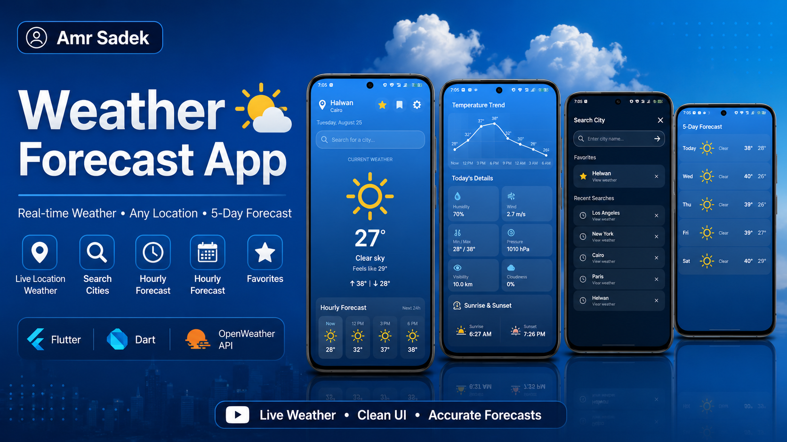
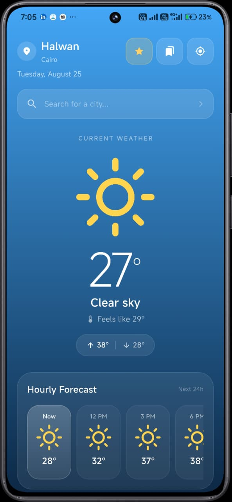
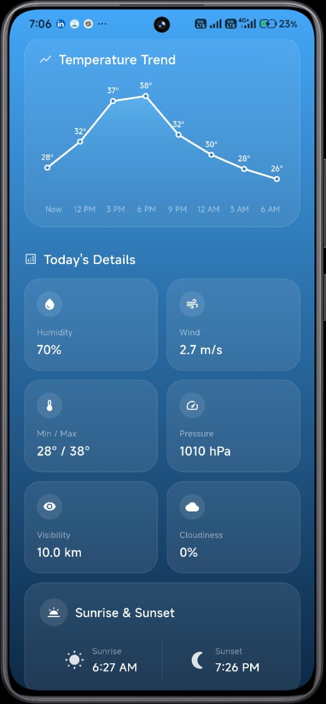
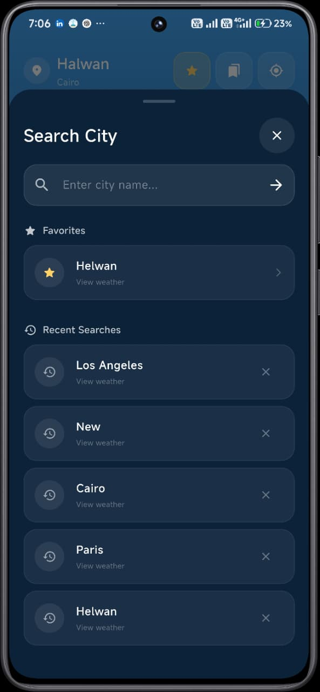
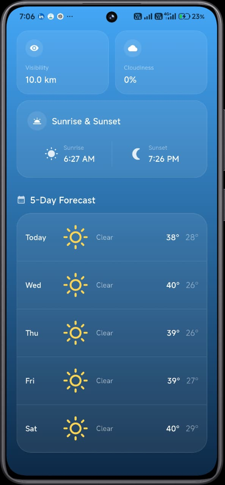

# 🌤️ Weather Forecast App

A Flutter mobile application that displays real-time weather information using the OpenWeather API.

The app supports location-based weather, city search, hourly forecasts, and a 5-day forecast.

<p align="center">
  
</p>

---

## Features

- Current weather based on device location
- Search weather by city
- Current temperature and feels-like temperature
- Weather condition
- Humidity
- Wind speed
- Visibility
- Cloudiness
- Sunrise and sunset
- Hourly forecast
- 5-day forecast
- Temperature trend
- Favorite cities

---

## Tech Stack

- Flutter
- Dart
- OpenWeather API
- Geolocator
- HTTP
- Shared Preferences
- Weather Icons

---

## Screenshots

<p align="center">
  
  
</p>

<p align="center">
  
  
</p>

---

## API

Weather data is provided by the OpenWeather API.

The app uses the API to retrieve current weather and forecast data based on the user's location or selected city.

---

## Run the Project

Clone the repository:

```bash
git clone https://github.com/YOUR_USERNAME/weather_forecast_app.git
```

Open the project:

```bash
cd weather_forecast_app
```

Install dependencies:

```bash
flutter pub get
```

Run the application:

```bash
flutter run
```

---

## APK

The Android APK is available in the GitHub Releases section.

[Download APK](../../releases/latest)

---

## Project Structure

```text
lib/
├── models/
│   ├── forecast_model.dart
│   └── weather_model.dart
├── screens/
│   └── home_screen.dart
├── services/
│   ├── favorites_service.dart
│   └── weather_service.dart
├── widgets/
│   └── temperature_chart.dart
└── main.dart
```

---

## Developer

**Amr Sadek**

Flutter Developer
